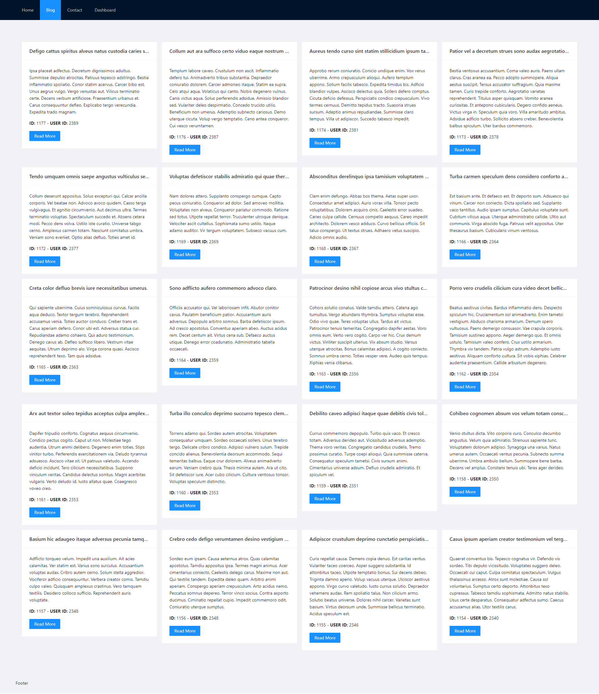
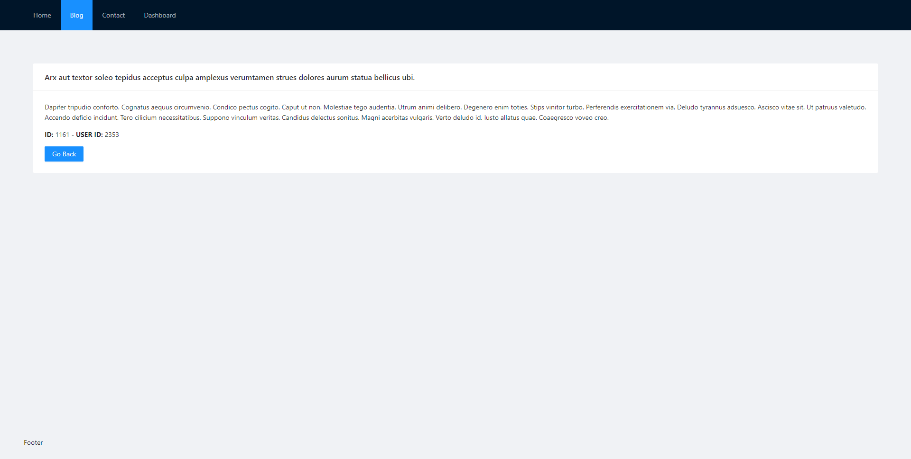

<h1 align="left">Hiii </h1>

## 👀 APP DETAILS

- 👉 project name: react routing template with serverside blog post handle
- 👉 project description: This program consists of 6 pages: header, footer, content, dashboard, blog and post. The blog page contains the list of posts. The post page also contains the details of each post.
- 👉 use `npm start` to run app
- 👉 In this app, `react 18` has been used
- 👉 In this app, `react-router-dom 6` has been used

### Screenshot:

